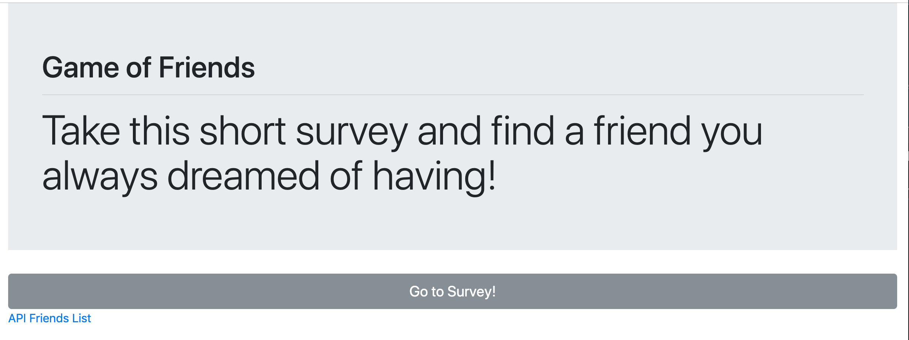
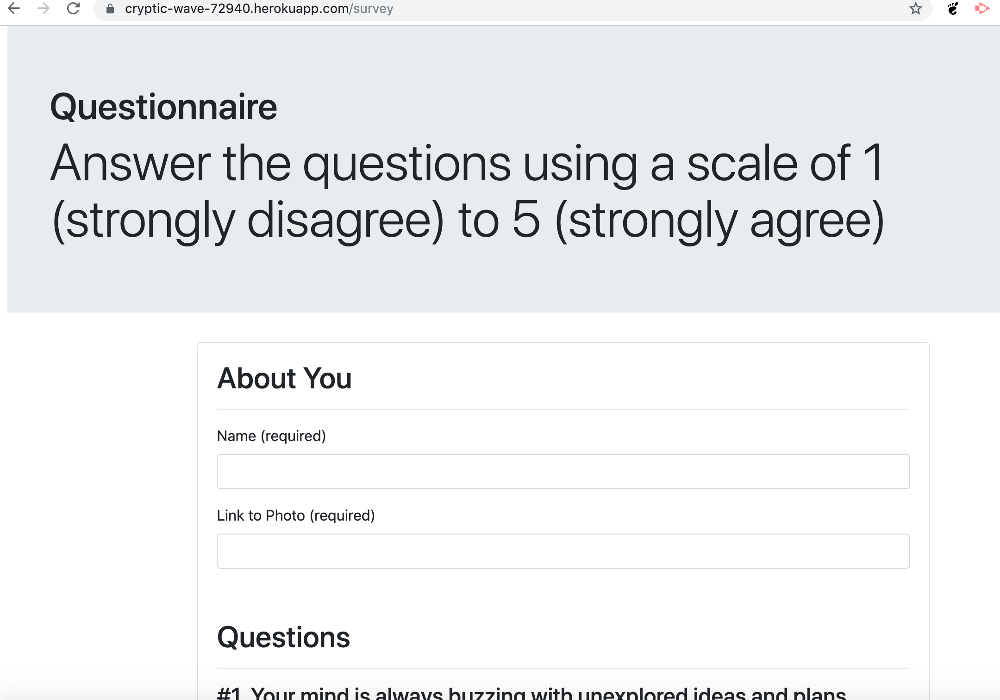

# FriendFinder

Created during week 7 of DU coding bootcamp. The goal was to create this full-stack site that will take in results from users' surveys, then compare their answers with those from other users. The app will then display the name and picture of the user with the best overall match.

**** Getting Started ****

https://cryptic-wave-72940.herokuapp.com/

HERE is an example of survey page onload.

HERE is an example of questions page 

I hope you enjoy my app and finally will find a true friend you always dreamed of having!
